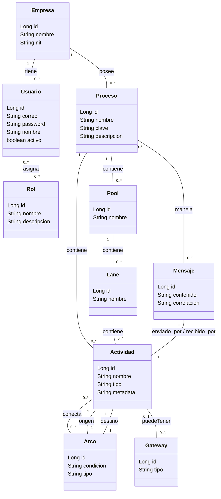

# Editor y Visualizador de Procesos BPMN - Entrega 1 Proyecto

Sistema web server-side desarrollado con **Java 17**, **Spring Boot**, **JPA/Hibernate** y **Thymeleaf** para el diseño, gestión y modelado dinámico de procesos de negocio bajo el estándar **BPMN**.

El proyecto permite la administración multitenant de empresas, usuarios, roles, piscinas (*pools*), carriles (*lanes*), actividades, arcos, compuertas (*gateways*) y la simulación/gestión de mensajería inter-proceso.

---

## Diagrama de clases



## Arquitectura y Estructura del Proyecto

El proyecto aplica el patrón de arquitectura en capas (**N-Tier / Layered Architecture**) y la segregación del patrón **MVC (Model-View-Controller)**:

```text
src/main/java/com/tuempresa/bpmneditor/
├── config/             # Configuración general (Security, WebMvc, DataInitializer)
├── controller/         # Controladores Spring MVC (Gestión de peticiones HTTP y flujo de vistas)
├── dto/                # Data Transfer Objects para transporte y validación de formularios
├── exception/          # Manejo centralizado de excepciones (@ControllerAdvice, custom exceptions)
├── model/              # Entidades JPA (Empresa, Usuario, Proceso, Actividad, Pool, Lane, etc.)
├── repository/         # Interfaces Spring Data JPA y consultas custom (JPQL / Named Queries)
└── service/            # Capa de servicio con la lógica de negocio del dominio BPMN

src/main/resources/
├── db/migration/       # Scripts de inicialización / Migraciones de BD (si aplica)
├── static/             # Recursos estáticos (CSS, JS, imágenes, SVG icons)
├── templates/          # Vistas dynamic Thymeleaf (Layouts, fragmentos y páginas)
└── application.yml     # Archivo de configuración principal del entorno
```

---

## Tecnologías Utilizadas

- **Lenguaje:** Java 17+
- **Framework Principal:** Spring Boot 3.x
- **Persistencia de Datos:** Spring Data JPA / Hibernate ORM
- **Motor de Vistas:** Thymeleaf + Layout Dialect (Fragmentos reutilizables)
- **Base de Datos:** H2 Database (Desarrollo/Testing) / PostgreSQL o MySQL (Producción)
- **Validación:** Spring Validation (`jakarta.validation`)
- **Control de Versiones y Calidad:** Git + SonarQube

---

## Historias de Usuario Cubiertas

### Gestión de Empresas y Usuarios
- **HU-01:** Registro de empresa
- **HU-02:** Registro de usuario en empresa
- **HU-03:** Inicio de sesión

### Gestión de Procesos
- **HU-04:** Crear proceso
- **HU-05:** Editar proceso
- **HU-06:** Eliminar proceso
- **HU-07:** Consultar procesos

### Modelado del Proceso (Actividades, Arcos y Gateways)
- **HU-08:** Crear actividad
- **HU-09:** Editar actividad
- **HU-10:** Eliminar actividad
- **HU-11:** Crear arco
- **HU-12:** Editar arco
- **HU-13:** Eliminar arco
- **HU-14:** Crear gateway
- **HU-15:** Editar gateway
- **HU-16:** Eliminar gateway

### Roles de Proceso
- **HU-17:** Crear rol de proceso
- **HU-18:** Editar rol de proceso
- **HU-19:** Eliminar rol de proceso
- **HU-20:** Consultar roles de proceso

### Pools y Lanes
- **HU-21:** Configurar pool por empresa
- **HU-22:** Diferenciar pool y lane (*swimlane*)
- **HU-23:** Compartir procesos entre pools (alcance y límites)
- **HU-24:** Asociar roles y permisos a un pool

### Mensajes y Colaboración entre Pools
- **HU-25:** Enviar mensaje entre procesos (*Message Throw*)
- **HU-26:** Envío de notificaciones externas (mensaje a sistema externo)
- **HU-27:** Recibir mensaje y activar proceso (*Message Catch*)
- **HU-28:** Correlación de mensajes con instancias de proceso

---

## Requisitos Previos

Asegúrate de tener instaladas las siguientes herramientas en tu entorno de desarrollo:

- **JDK 17** o superior
- **Apache Maven 3.8+** o **Gradle**
- **Git**
- *(Opcional)* **SonarQube Server / SonarLint** para análisis estático de código.

---

---

## Ejecucion del backend

El backend es una API REST (Spring Boot 3, Java 17). No tiene frontend: se
prueba con Postman o con cualquier cliente HTTP.

**Primera entrega: sin autenticacion.** Toda la API es publica. La empresa de cada
peticion se indica con el encabezado `X-Empresa-Id` (si no viene, se usa `1`).
Esto no es seguridad, solo permite probar por empresa; la autenticacion real
(JWT, roles, aislamiento por token) es de la entrega final; la version con JWT
quedo en el historial de `main` (commit `7fb8a02`).

### Perfiles

| Perfil    | Base de datos                       | Para que sirve                              |
|-----------|-------------------------------------|---------------------------------------------|
| `h2`      | H2 en memoria                       | Arrancar sin instalar nada                  |
| `local`   | PostgreSQL local                    | Desarrollo con una base propia              |
| `postman` | PostgreSQL por variables de entorno | Probar con la coleccion de Postman          |
| (ninguno) | PostgreSQL por variables de entorno | Despliegue: exige todas las variables       |

### Arrancar con H2 (sin PostgreSQL)

```bash
cd thymeleaf
./mvnw spring-boot:run -Dspring-boot.run.profiles=h2
```

En Windows PowerShell: `.\mvnw spring-boot:run "-Dspring-boot.run.profiles=h2"`.

Queda en `http://localhost:8080`. Con `APP_MAIL_ENABLED=false` (el valor por
defecto) el enlace de verificacion **se imprime en la consola** en vez de
enviarse por correo; copialo de ahi.

Al arrancar con la base vacia, el inicializador crea la empresa `Empresa Demo`
(id 1), el usuario `admin@demo.com` y el proceso `Solicitud de vacaciones`.
Para poder iniciar sesion con ese admin, define `DEMO_ADMIN_PASSWORD` antes de
arrancar (`$env:DEMO_ADMIN_PASSWORD = "..."` en PowerShell, `export` en Linux);
si no, queda inactivo y se activa como cualquier otro usuario:
`POST /api/auth/reenviar-verificacion` con `{"correo":"admin@demo.com"}`,
token de la consola, y `POST /api/auth/activar-cuenta`.

### Arrancar contra PostgreSQL

```bash
cd thymeleaf
export DB_HOST=... DB_PORT=... DB_NAME=... DB_USER=... DB_PASSWORD=...
./mvnw spring-boot:run -Dspring-boot.run.profiles=postman
```

En PowerShell las variables se definen con `$env:DB_HOST = "..."`.

### Variables de entorno

| Variable | Obligatoria | Descripcion |
|---|---|---|
| `DB_HOST`, `DB_PORT`, `DB_NAME`, `DB_USER`, `DB_PASSWORD` | Si (sin perfil / `postman`) | Conexion a PostgreSQL. Nunca se versionan valores reales. |
| `DEMO_ADMIN_PASSWORD` | No | Contrasena del admin de demo `admin@demo.com` que crea el inicializador de datos. Si no se define, ese admin queda inactivo y se activa con `reenviar-verificacion` + `activar-cuenta`. |
| `APP_MAIL_ENABLED` | No (`false`) | `true` envia correos reales; `false` imprime el enlace en el log. |
| `APP_MAIL_FROM` | No | Remitente. |
| `APP_MAIL_FAIL_ON_ERROR` | No (`false`) | `true` hace que un fallo SMTP aborte el registro; `false` lo registra y sigue. |
| `APP_BACKEND_BASE_URL` | No (`http://localhost:8080`) | Base del enlace que va en el correo. |
| `MAIL_HOST`, `MAIL_PORT`, `MAIL_USERNAME`, `MAIL_PASSWORD` | Solo si `APP_MAIL_ENABLED=true` | SMTP. Con Gmail, `MAIL_PASSWORD` es una *contrasena de aplicacion*. |

**Nunca subas un `.env` real ni credenciales a git.**

## Documentacion de la API (Swagger / OpenAPI)

Con el backend arrancado, la documentacion interactiva queda en:

- `http://localhost:8080/swagger-ui.html`: pagina Swagger UI con todos los
  endpoints, sus parametros, el JSON que reciben y el que devuelven. Cada uno
  tiene el boton **Try it out** para ejecutarlo desde el navegador.
- `http://localhost:8080/v3/api-docs`: el contrato OpenAPI en JSON (se puede
  importar en Postman con *Import > Link*).

Se genera sola con `springdoc-openapi` a partir de los controladores; no hay
que mantener nada a mano. El encabezado `X-Empresa-Id` aparece en todos los
endpoints de `/api/v1/` (lo agrega `config/OpenApiConfig.java`).

## Probar con Postman

Importa `thymeleaf/postman_collection.json` y `thymeleaf/postman_environment.json`
y selecciona el entorno *Proyecto1 - Local*. La coleccion agrega sola el
encabezado `X-Empresa-Id` con el valor de la variable de entorno `empresaId`
(por defecto `1`); cambiala para probar otra empresa.

Flujo minimo, en orden:

1. **`POST /api/v1/empresas`**: registra la empresa. Se crea su administrador
   **inactivo y sin contrasena utilizable**.
2. Copia el token del enlace que aparece en la consola del backend (o en el
   correo, si `APP_MAIL_ENABLED=true`) en la variable de entorno `{{token}}`.
3. **`POST /api/auth/activar-cuenta`**: manda `{"token": "...", "nuevaPassword": "ClaveSegura123"}`.
   Es el unico modo de activar al administrador inicial.
4. **`POST /api/v1/usuarios/login`**: con el correo de la empresa y esa
   contrasena. Devuelve el usuario (200) o 401 sin cuerpo.
5. El resto de peticiones usan el `X-Empresa-Id` del entorno.

### Endpoints

| Metodo | Ruta | Que hace |
|---|---|---|
| POST | `/api/v1/empresas` | Registra empresa + administrador inicial (inactivo) |
| GET/PUT/DELETE | `/api/v1/empresas`, `/{id}` | Consultar, editar, borrado logico |
| POST | `/api/v1/usuarios/login` | Valida credenciales y cuenta activa; 401 sin cuerpo si falla |
| POST | `/api/auth/activar-cuenta` | Token + contrasena nueva: activa la cuenta |
| GET | `/api/auth/verificar-correo?token=` | Solo activa (usuarios que ya tienen contrasena) |
| POST | `/api/auth/reenviar-verificacion` | Reenvia el enlace; misma respuesta exista o no el correo; maximo 3 por hora |
| GET/POST | `/api/v1/usuarios`, `/{id}`, `/{id}/rol`, `/{id}/desactivar`, DELETE `/{id}` | Usuarios de la empresa, sin contrasena en las respuestas |
| GET | `/api/v1/procesos?incluirInactivos=false` | Lista (activos por defecto) |
| GET | `/api/v1/procesos/buscar?nombre=&estado=&categoria=&page=0&size=10` | Busqueda paginada |
| POST/PUT/DELETE | `/api/v1/procesos`, `/{id}` | Crear (nombre unico por empresa), editar, borrado logico |
| POST | `/api/v1/procesos/{id}/publicar`, `/inactivar`, `/reactivar` | Cambios de estado |
| CRUD | `/api/v1/procesos/{p}/actividades`, `/gateways`, `/arcos`, `/elementos` | Modelado |

Los errores llegan siempre como `{ "timestamp", "status", "mensaje" }`:
`400` reglas de negocio o datos invalidos, `500` error interno sin detalles.

### Ejemplos

```http
POST /api/v1/empresas
Content-Type: application/json

{ "nombre": "Constructora Norte", "nit": "900123456", "correo": "admin@norte.com" }
```

```http
POST /api/auth/activar-cuenta
Content-Type: application/json

{ "token": "<token del enlace>", "nuevaPassword": "ClaveSegura123" }
```

```http
POST /api/v1/procesos
X-Empresa-Id: 1
Content-Type: application/json

{ "nombre": "Compras", "descripcion": "Solicitud y aprobacion de compras", "categoria": "Operaciones" }
```

## Pruebas de carga (JMeter)

El plan `thymeleaf/src/test/jmeter/plan-carga.jmx` lanza usuarios concurrentes
contra `GET /api/v1/procesos`, `GET /api/v1/procesos/buscar` y
`POST /api/v1/procesos`, y verifica que respondan 200/201. No hace falta
instalar JMeter: el plugin de Maven lo descarga la primera vez.

1. Arranca el backend en otra terminal (`./mvnw spring-boot:run -Dspring-boot.run.profiles=h2`).
2. Ejecuta, desde `thymeleaf`:

```bash
./mvnw jmeter:configure jmeter:jmeter jmeter:results
```

En PowerShell: `.\mvnw jmeter:configure jmeter:jmeter jmeter:results`.

Por defecto son 20 usuarios, rampa de 10 s y 5 repeticiones (20 x 5 x 3
endpoints = 300 peticiones). Se cambian sin tocar el plan:

```bash
./mvnw jmeter:configure jmeter:jmeter jmeter:results -Dcarga.usuarios=50 -Dcarga.rampa=20 -Dcarga.repeticiones=10
```

Resultados:

- Consola: total de peticiones, errores y tiempos de respuesta.
- `thymeleaf/target/jmeter/results/*.csv`: una fila por peticion.
- `thymeleaf/target/jmeter/reports/<fecha-hora>/plan-carga/index.html`: reporte
  HTML con graficas (abrirlo en el navegador). Cada corrida crea su carpeta.

Para editar el plan con la interfaz grafica de JMeter, ejecuta `./mvnw jmeter:configure`
y abre `plan-carga.jmx` con `target/jmeter/apache-jmeter-*/bin/jmeter` (o con un
JMeter instalado aparte).
