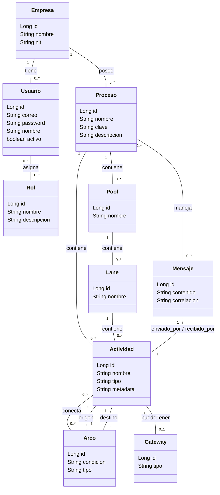

# Editor y Visualizador de Procesos BPMN - Entrega 1 Proyecto

Sistema web server-side desarrollado con **Java 17**, **Spring Boot**, **JPA/Hibernate** y **Thymeleaf** para el diseño, gestión y modelado dinámico de procesos de negocio bajo el estándar **BPMN**.

El proyecto permite la administración multitenant de empresas, usuarios, roles, piscinas (*pools*), carriles (*lanes*), actividades, arcos, compuertas (*gateways*) y la simulación/gestión de mensajería inter-proceso.

---

## Diagrama de clases



## Arquitectura y Estructura del Proyecto

El proyecto aplica el patrón de arquitectura en capas (**N-Tier / Layered Architecture**) y la segregación del patrón **MVC (Model-View-Controller)**:

```text
src/main/java/com/tuempresa/bpmneditor/
├── config/             # Configuración general (Security, WebMvc, DataInitializer)
├── controller/         # Controladores Spring MVC (Gestión de peticiones HTTP y flujo de vistas)
├── dto/                # Data Transfer Objects para transporte y validación de formularios
├── exception/          # Manejo centralizado de excepciones (@ControllerAdvice, custom exceptions)
├── model/              # Entidades JPA (Empresa, Usuario, Proceso, Actividad, Pool, Lane, etc.)
├── repository/         # Interfaces Spring Data JPA y consultas custom (JPQL / Named Queries)
└── service/            # Capa de servicio con la lógica de negocio del dominio BPMN

src/main/resources/
├── db/migration/       # Scripts de inicialización / Migraciones de BD (si aplica)
├── static/             # Recursos estáticos (CSS, JS, imágenes, SVG icons)
├── templates/          # Vistas dynamic Thymeleaf (Layouts, fragmentos y páginas)
└── application.yml     # Archivo de configuración principal del entorno
```

---

## Tecnologías Utilizadas

- **Lenguaje:** Java 17+
- **Framework Principal:** Spring Boot 3.x
- **Persistencia de Datos:** Spring Data JPA / Hibernate ORM
- **Motor de Vistas:** Thymeleaf + Layout Dialect (Fragmentos reutilizables)
- **Base de Datos:** H2 Database (Desarrollo/Testing) / PostgreSQL o MySQL (Producción)
- **Validación:** Spring Validation (`jakarta.validation`)
- **Control de Versiones y Calidad:** Git + SonarQube

---

## Historias de Usuario Cubiertas

### Gestión de Empresas y Usuarios
- **HU-01:** Registro de empresa
- **HU-02:** Registro de usuario en empresa
- **HU-03:** Inicio de sesión

### Gestión de Procesos
- **HU-04:** Crear proceso
- **HU-05:** Editar proceso
- **HU-06:** Eliminar proceso
- **HU-07:** Consultar procesos

### Modelado del Proceso (Actividades, Arcos y Gateways)
- **HU-08:** Crear actividad
- **HU-09:** Editar actividad
- **HU-10:** Eliminar actividad
- **HU-11:** Crear arco
- **HU-12:** Editar arco
- **HU-13:** Eliminar arco
- **HU-14:** Crear gateway
- **HU-15:** Editar gateway
- **HU-16:** Eliminar gateway

### Roles de Proceso
- **HU-17:** Crear rol de proceso
- **HU-18:** Editar rol de proceso
- **HU-19:** Eliminar rol de proceso
- **HU-20:** Consultar roles de proceso

### Pools y Lanes
- **HU-21:** Configurar pool por empresa
- **HU-22:** Diferenciar pool y lane (*swimlane*)
- **HU-23:** Compartir procesos entre pools (alcance y límites)
- **HU-24:** Asociar roles y permisos a un pool

### Mensajes y Colaboración entre Pools
- **HU-25:** Enviar mensaje entre procesos (*Message Throw*)
- **HU-26:** Envío de notificaciones externas (mensaje a sistema externo)
- **HU-27:** Recibir mensaje y activar proceso (*Message Catch*)
- **HU-28:** Correlación de mensajes con instancias de proceso

---

## Requisitos Previos

Asegúrate de tener instaladas las siguientes herramientas en tu entorno de desarrollo:

- **JDK 17** o superior
- **Apache Maven 3.8+** o **Gradle**
- **Git**
- *(Opcional)* **SonarQube Server / SonarLint** para análisis estático de código.

---
